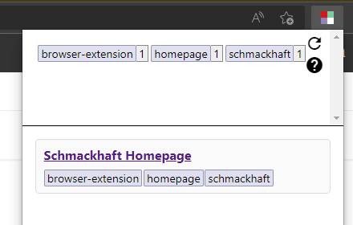
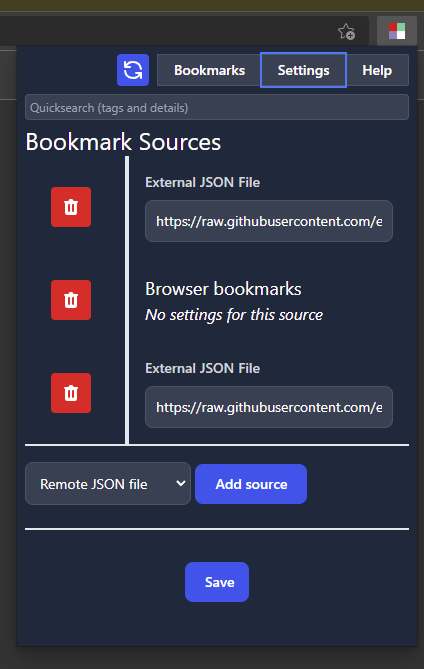

# Schmackhaft

## Early Development

This is an early release for this extension which scratches my own itch.
Development will be slow, unless I notice public interest. In that case I might
shuffle around some priorities to invest more time in this extension.

Feedback is of course more than welcome, epecially in this early stage of the
project.

The biggest shortcoming right now is the visual design and UX of the extension.
As this is, for now, dogfood-ware, this might remain basic as UI/UX design is
not my strength.

## Installation

Except for Edge, the extension must be manually installed using [a release
generated on GitHub](https://github.com/exhuma/schmackhaft/releases). For Edge,
it should be available in the extension store.

Extension publishing to the different browser stores is cumbersome and
therefore, expect the extension to be available _only_ in Edge for now as this
is the most forgiving:

- The Mozilla store requires a simpler build process: The extension is manually
  validated on the Mozilla store. This means, the build process must eliminate
  human error to the best of its abilities. And this is currently not
  guaranteed. Evidenced by the fact that I keep getting validation rejections
  because the person validating it is not getting the correct build result.
- The Chrome web store is not allowing submissions from Luxembourg (at the time
  of this writing).
- The Edge extension store has - so far - always verified and validated the
  extension with no issue.

## Description

This extension allows the storage of bookmarks in a _non-hierarchical_
structure. Each bookmark is identified by the URL and has a collection of
_tags_. They can then be browsed by filtering according to those tags.

This in turn allows "drilling down" into tags without being forced to pick a
specific tag as "first level". So whether you pick "Python" first and _then_
"Programming" is going to be the same as picking "Programming" first followed by
"Python".

This reproduces a behaviour reminiscent to to https://del.icio.us from the early
2000s which has since completely changed its behaviour and has - to the best of
my knowledge - become effectively defunct.

## Screenshots

### Browser Button

The Browser Button gives access to the stored bookmarks. It also contains a
refresh button to force a reload. This can be useful if remote JSON URLs have
changed.

Clicking on the tag-chips at the top will cycle their filtering state. By
default they are "ignored" in filtering. Clicking once will set them to an
"inclusive" state. This will show _only_ links that have this tag. Clicking
again will set them to an "exclusive" state. This will _hide_ all links that
have this tag.

The state-transition is:

    neutral -> included -> excluded -> neutral ...

Right-Clicking on a tag will set the state in reverse:

    neutral -> excluded -> included -> neutral ...

The bottom panel will show the links with the tag-states applied.



### Preferences/Options

The extension currently has two main options:

- A list of external JSON URLs
- An option to include browser-stored bookmarks in the UI or not.

Each JSON URL can store bookmarks in the format described below. To remove a
URL, simply set it to the empty string.

Enabling the browser bookmarks will make them available. They will all have the
automatic tag "browser bookmark" and each folder-name is used as additional
tags.



## Adding Bookmarks

Currently it is _only_ possible to get bookmarks from an external JSON file. An
example use-case is to load it from a GitHub repository.

An option to add bookmarks directly via the extension will be added in the
future.

## Bookmark Collections

The extension aims to provide support for multiple collections from which to
draw un when browsing the bookmarks. This currently (in version 0.3) only
supports external JSON files and the bookmarks stored in the browser.
Collection support is flexible in the source code and additional collections can
be added fairly easily.

### Web URL (JSON)

The initially supported JSON collection is read-only and only simple HTTP-GET
requests are made. An example collection looks like this:

```javascript
[
  {
    href: "https://www.google.com",
    tags: ["search", "google"],
    title: "Google Search",
    description: "An example description",
  },
  {
    href: "https://news.ycombinator.com",
    tags: ["news", "it"],
  },
  {
    href: "https://duckduckgo.com",
    tags: ["search"],
  },
  {
    href: "https://bbc.com",
    tags: ["news", "world"],
  },
];
```

## Development, Building & Maintenance

Bug/Feature-tracker is over at [exhuma/schmackhaft](https://github.com/exhuma/schmackhaft).

The project provides a VS-Code "development container". This is optional
but provides a reproducible build environment with all required system
dependencies. When working with VS-Code (including the
`ms-vscode-remote.vscode-remote-extensionpack` extension) the development
container can be built manually by opening the command-pallette (CTRL-SHIFT-P)
and selecting `Remote-Containers: Rebuild Container` command. This can also be
used any time something in the container has changed.

1. Clone the Repository

   ```
   git clone https://github.com/exhuma/schmackhaft
   cd schmackhaft
   ```

1. Build the development container

   - VS-Code "Remote Containers" extension:
     - Select "Remote-Containers: Rebuild Container" from the command-pallette
       (CTRL-SHIFT-P)
   - Without VS-Code
     ```
     docker build -t schmackhaft-dev-container -f .devcontainer/Dockerfile .
     ```

1. Build the extension

   - VS-Code "Remote Containers" extension:
     - Open a terminal inside VS-Code and run:
       ```
       make dist
       ```

   - Without VS-Code
     - Fetch required npm dependencies:
       ```
       docker run \
         --rm \
         -it \
         -u $(id -u) \
         -v $(pwd):/data \
         -w /data \
         schmackhaft-dev-container \
         npm ci
       ```
     - Build the extension:
       ```
       docker run \
         --rm \
         -it \
         -u $(id -u) \
         -v $(pwd):/data \
         -w /data \
         schmackhaft-dev-container \
         make dist
       ```

   This will create the following artifacts:

   - `dist/*.zip`

     Zipped files, ready for distribution to the browser app stores

   - `unpackaged/mozilla`

     The generated source-code for Mozilla based browsers

   - `unpackaged/chrome`

     The generated source-code for Chromium based browsers

### Component Development

For an easier development cycle, a lot of code is written in
[lit](https://lit.dev). This allows us to run a development server with `npm run
serve` and access `/demo/index.html` to try out the components. This makes it
possible to have a develop/test cycle without the need to reload the browser
extension. It also makes it a lot easier to use the browser development tools.

## Load the extension into the browser for testing

- [Mozilla: Installing Web Extensions](https://developer.mozilla.org/en-US/docs/Mozilla/Add-ons/WebExtensions/Your_first_WebExtension#installing)
- [Chrome: Loading unpacked extensions](https://developer.chrome.com/docs/extensions/mv3/getstarted/#unpacked)
