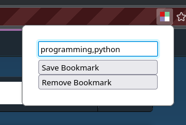
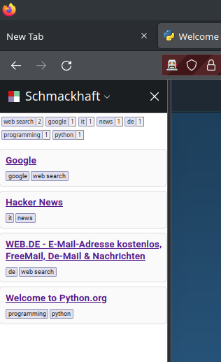
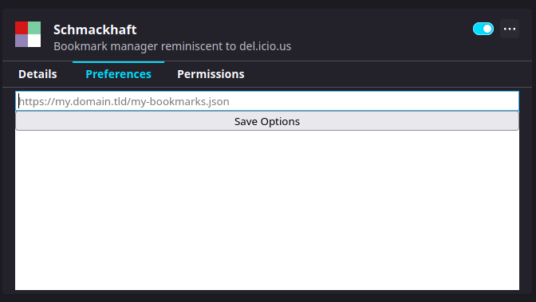

# Schmackhaft

## Description

This extension allows the storage of bookmarks in a non-hierarchical structure. Each bookmark is identified by the URL and has a collection of tags. They can then be browsed by filtering according to those tags.

This in turn allows "drilling down" into tags without being forced to pick a specific tag as "first level". So whether you pick "Python" first and _then_ "Programming" is going to be the same as picking "Programming" first followed by "Python".

This reproduces a behaviour reminiscen to to https://del.icio.us from the early 2000s which has since completely changed its behaviour and is - to the best of my knowledge - become effectively defunct.

## Screenshots

### Page Action

The page action offers a way to add and remove bookmarks. Saving over an existing bookmark will replace any existing tags.



### Sidebar

The sidebar is the main bookmark navigation UI in v0.2. Clicking on the tag-chips at the top will add them to the filter. Clicking on a filtered tag will remove it again.



### Preferences

As of version 0.2, the preferences offers the possibility to add a remote web URL to the collections. This should point to a JSON documnent with links and their tags. See the "Collections" section below for an example.



## Bookmark Collections

The extension aims to provide support for multiple collections from which to draw un when browsing the bookmarks. In this first iteration (v0.2) this supports browser local-storage (non synced) and an external JSON URL (without authentication just yet). Collection support is flexible in the source code and additional collections can be added fairly easily.

### Web URL (JSON)

The initially supported JSON collection is read-only and only simple HTTP-GET requests are made. An example collection looks like this:

```javascript
[
  {
    href: "https://www.google.com",
    tags: ["search", "google"],
    title: "Google Search",
  },
  {
    href: "https://news.ycombinator.com",
    tags: ["news", "it"],
  },
  {
    href: "https://duckduckgo.com",
    tags: ["search"],
  },
  {
    href: "https://bbc.com",
    tags: ["news", "world"],
  },
];
```

## Development & Maintenance

1. Clone the Repository

   ```
   git clone https://github.com/exhuma/schmackhaft
   cd schmackhaft
   ```

1. Install all dependencies

   ```
   npm ci
   ```

1. Run the auto-reloading build process

   This process will monitor the code-base for any changes and automatically
   build the JavaScript files from the TypeScript files and bundle them up for
   usage as a browser extension.

   ```
   npm run autobuild
   ```

1. Run a web-browser with the extension

   This process will open a new web-browser in development mode with the
   extension readily loaded. It also automatically reloads the extension on any
   changes.

   ```
   npm run browser
   ```
