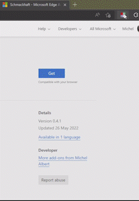

# Schmackhaft

[][ff-page]
[][edge-page]

## The "What/Why/When/Where/Who"

### What is "schmackhaft"?

Schmackhaft is a browser extension to navigate (and manage) browser bookmarks
based on tags. As of version "1.0", navigating is comfortable. The "manage" part
is still very limited.

Schmackhaft aggregates bookmarks from a configurable collection of "sources".
Whether these "sources" allow adding new bookmarks, depends on the source.

The above screenshots shows the main interface. In the screenshot, the bookmarks are filtered to include everything with the tag "programming" and _exclude_ everything with the tag "YouTube Channel".

### Why "schmackhaft"?

This is twofold:

- Scratching my own itch: I loved using `del.icio.us` when it was still fully
  functional. It made it really simple to save bookmarks and find them back
  _efficiently_. `schmackhaft` intends to reproduce this efficient browsing.
- Sharing Bookmarks: At the office we (a team of sys-admins and developers)
  would like to provide our users with a list of bookmarks to our applications.

### When/Where/Who?

Development started in mid 2022 here on GitHub by Michel Albert.

## Installation

Distribution of the extension happens via the extension stores. With the
exception of Chrome (which does not allow publishing from Luxembourg) it should
be findable in the appropriate store.

_Note for Firefox: At the time of this writing, Mozilla is a bit finnicky to accept the build. If you cannot find it, follow the manual instruction below_.

Use the following links to the store listings:

- [Firefox/Mozilla Addons][ff-page]
- [Edge Extensions][edge-page]

## Manual Installation

Prebuilt releases are available in [the GitHub releases
page](https://github.com/exhuma/schmackhaft/releases/latest). These releases are
_unofficial and unsigned by the browsers_. As unsigned release, they must be
installed as "unpackaged" (edge) or "from file" (Firefox). This may not be
possible in a corporate environment.

## Including/Excluding Tags

To change a tag from being "inclusive" or "exclusive", simply click on it repeatedly (not double-clicking).

- Clicking one, will set it to "inclusive" (green).
- Clicking again will set it to "exclusive" (red).
- A third click reverts it to "neutral.

Right-clicking reverses the steps above. So you can simply right-click on a tag
to remove all links with that tag.

# Preferences/Options

See [the configuration page](docs/configuration.md)

# Development, Building & Maintenance

See [the development page](docs/development.md)

[edge-page]: https://microsoftedge.microsoft.com/addons/detail/schmackhaft/aemjihidkhdjpelcgdokkpalbeejgdhi
[ff-page]: https://addons.mozilla.org/en-US/firefox/addon/schmackhaft
